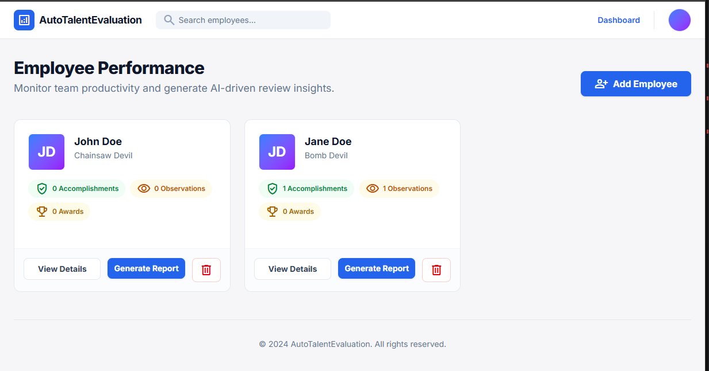
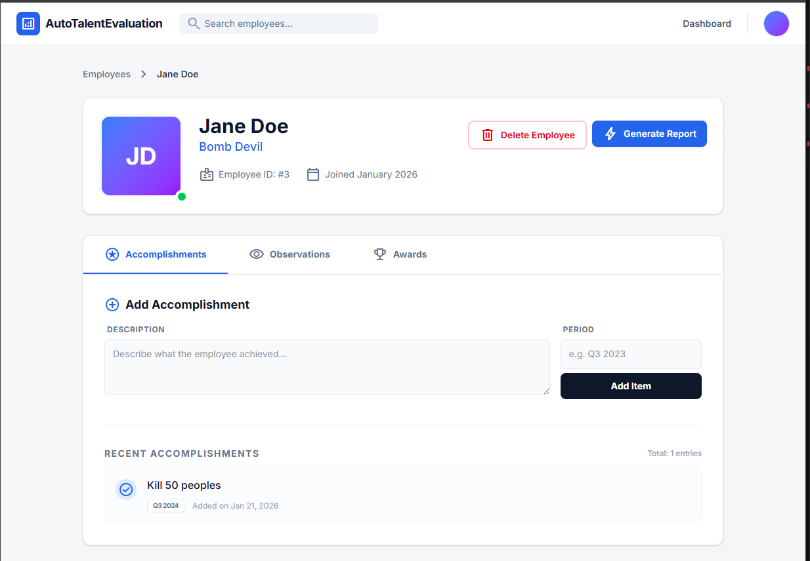
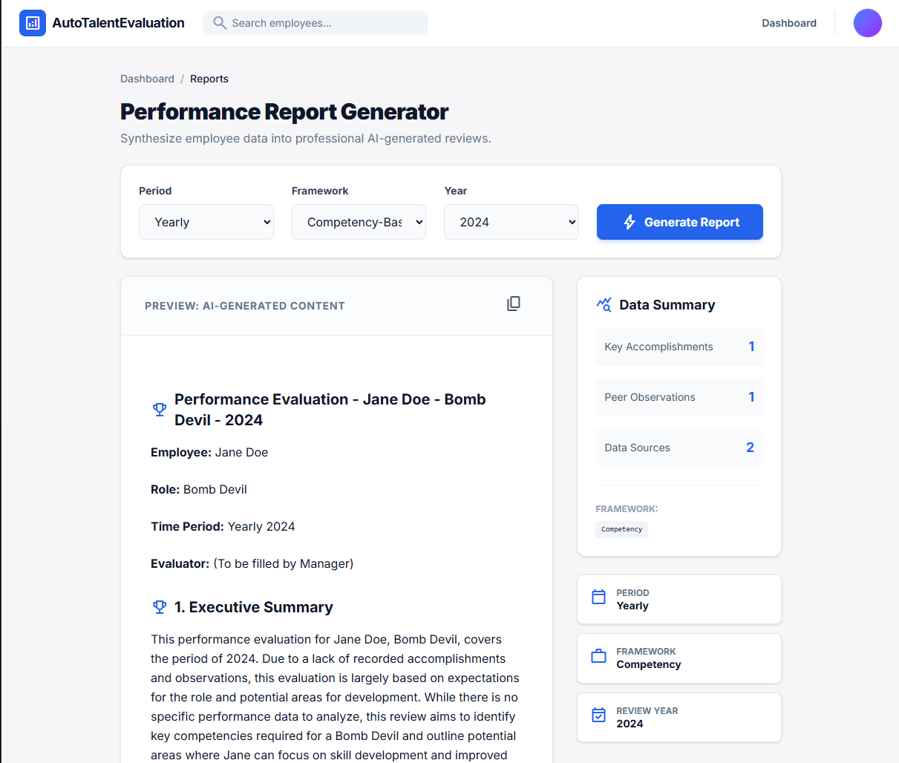

# AutoTalentEvaluation
 a simple web app for tracking employee performance and generating AI-powered performance reviews.

## What's this all about?

Managing employee evaluations can be a slog. You've got accomplishments to track, peer observations to collect, awards to recognize, and then you actually have to write thoughtful performance reviews. This app is meant to make that whole process a bit easier.

The idea is straightforward:
1. Add your team members and track their key accomplishments
2. Collect peer observations and feedback
3. Recognize employees with awards and achievements
4. Generate professional performance review summaries using AI (via Ollama)

It's built for lazy leader like me who needs to stay on top of employee evaluations without drowning in spreadsheets and Word docs.

## How it works

The app has four main parts:

- **Dashboard** — See all your employees at a glance with stats on accomplishments, observations, and awards

- **Employee Details** — Dive into a specific person's accomplishments, observations, and awards, with inline editing support

- **Award Management** — Track employee awards with pre-defined award types (configured in `default_data.toml`)
- **Report Generator** — Pick a framework (OKR, BARS, MBO, etc.), select a time period, and generate an AI-written performance review for input into HR system.

## Getting it running

You'll need a few things:

### Configuration

Award types are configured in `default_data.toml` at the project root. To customize available awards, edit the `types` array under `[award_types]`.

You'll also need:

1. **Node.js** installed (for the Next.js app)
2. **Ollama** running locally with the `gemma3:12b-it-qat` model pulled

### Step 1: Install dependencies

```bash
npm install
```

### Step 2: Set up Ollama

Make sure Ollama is installed and running, then pull the model:

```bash
ollama pull gemma3:12b-it-qat
```

### Step 3: Fire it up

```bash
npm run dev
```

Then open [http://localhost:3000](http://localhost:3000) in your browser.

## Tech stack

- **Next.js** — React framework with the app router
- **TypeScript** — For type safety
- **Tailwind CSS** — For styling
- **Ollama** — Local AI model for generating reports

This project was built with help from AI (Claude). 
